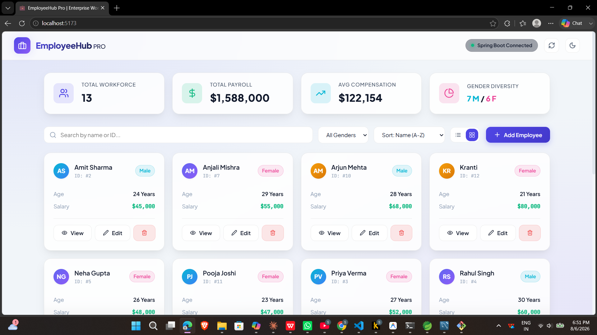
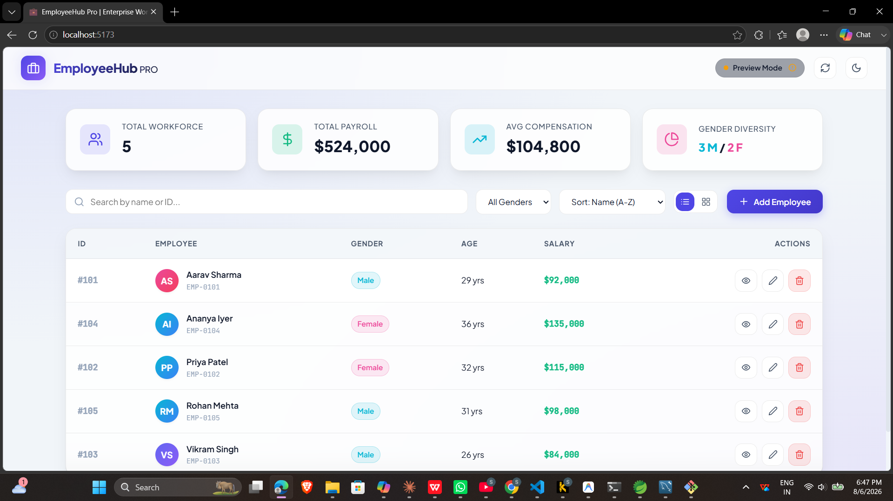
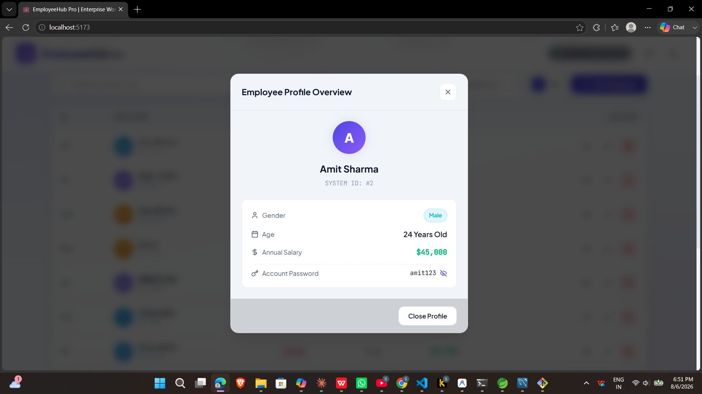

# EmployeeHub

## 📌 Overview
EmployeeHub Pro is an **Enterprise Workforce Management System** designed to streamline employee data management, payroll tracking, and workforce analytics. It provides HR teams and managers with a clean dashboard to monitor workforce statistics and manage employee records efficiently.

---

## 🚀 Features
- **Dashboard Metrics**
  - Total Workforce count
  - Payroll summary
  - Average compensation
  - Gender diversity statistics
- **Employee Management**
  - Add, edit, delete employees
  - Search and filter by gender, age, salary
  - Sort employee records
- **Data Security**
  - Role-based access control
  - Secure API endpoints
- **Scalable Architecture**
  - Backend powered by Spring Boot
  - Frontend built with React
  - MySQL database integration

---

## 🛠️ Tech Stack
- **Backend:** Spring Boot, Java
- **Frontend:** React.js
- **Database:** MySQL
- **Build Tool:** Maven
- **Version Control:** Git & GitHub

---

## 📷 Screenshots

### Dashboard



### Employee Table



---

## ⚙️ Setup & Installation

### Prerequisites
- Java 17+
- Node.js & npm
- MySQL Server
- Maven

### Steps
1. **Clone the repository**
   ```bash
   git clone https://github.com/shivamsurwase/EmployeHub.git
   cd EmployeHub
